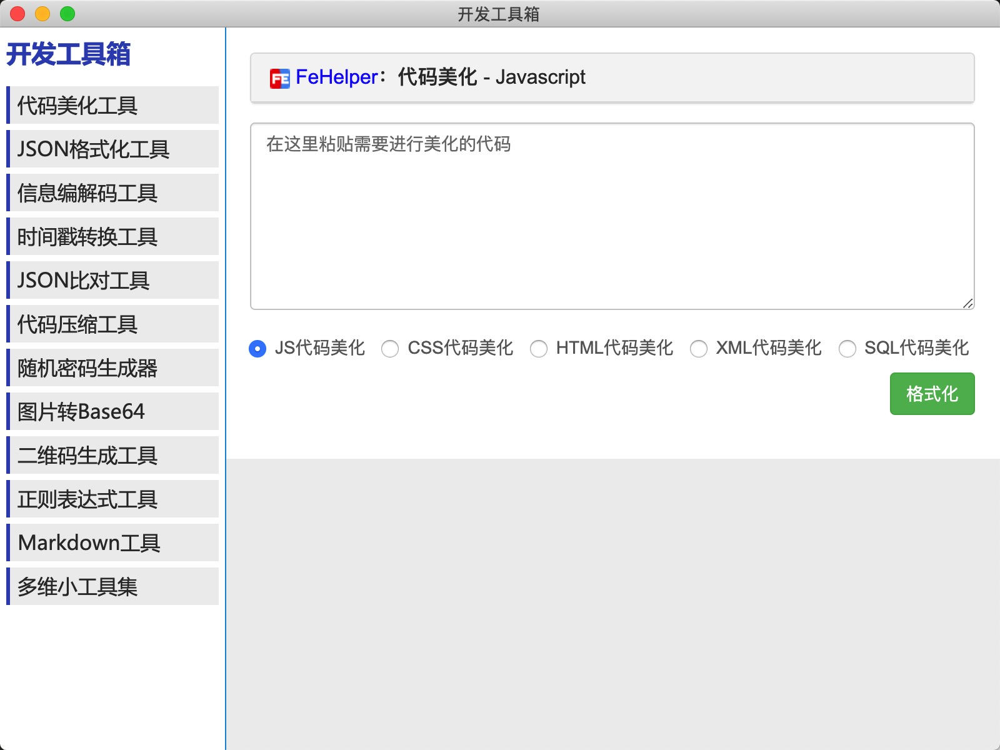

# xyzToolbox

基于 FeHelper 和 electron 做的桌面版封装。



Mac 安装包下载地址：

链接:https://pan.baidu.com/s/1SYjVX2Dhz6TTbaif1Bk8RA  密码:64oo


拉取项目和子模块

```
git clone https://xxx.git
git submodule init
git submodule update
```


打包命令

```
环境安装
npm install

# Linux打包成AppImage文件
# 在Linux环境上执行
node_modules/.bin/electron-builder -l AppImage

# Windows打包成exe安装文件
# 在Windows环境下执行
node_modules/.bin/electron-builder -w nsis
node_modules/.bin/electron-builder -w --ia32 nsis

# 如果在非Windows上打包win程序，也可以借助docker 如下
# docker run --rm -it -v ${PWD}:/project electronuserland/builder:wine sh -c "node_modules/.bin/electron-builder -w nsis"

# Mac打包成dmg文件
# 在Mac环境下执行
node_modules/.bin/electron-builder -m dmg
```

打包参考链接

> https://qii404.me/2019/07/10/electron.html